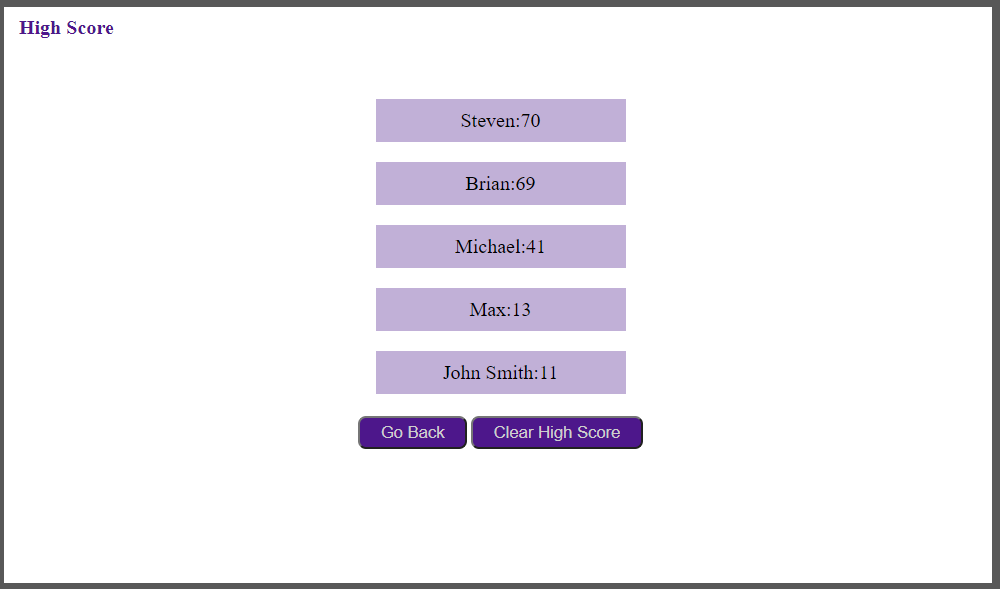

# Code-Quiz
I created a timed coding quiz that would ask multiple choice questions, notify the user of correct or incorrect responses, and allow the user to enter their name into the list of high scores if they completed the quiz with time remaining.

The quiz would generate the main page.  If the user clicked the start quiz button, the quiz would start the timer and generate a random multiple choice question. A wrong answer would remove fifteen seconds from the timer.

Clicking on the high score link would generate a list of all the high scores, saved to local storage, in descending order.  The high scores could be cleared from local storage by clicking the clear high score button.

## Link
The Code Quiz can be found [here](https://bthalpin.github.io/Code-Quiz/)

## Media
The following image shows the main page of the quiz: 

This is the quiz in progress:

The following image shows the score board:
