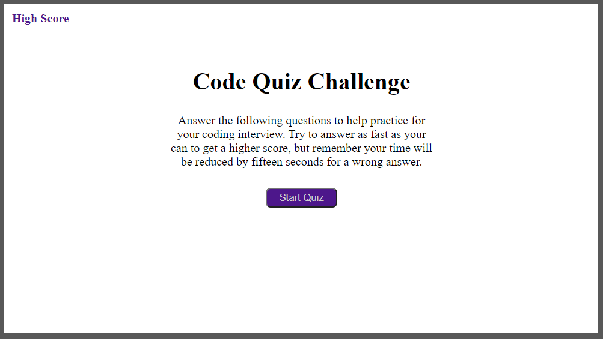

# Code-Quiz

## Link
The Code Quiz can be found [here](https://bthalpin.github.io/Code-Quiz/)

## Media
The following image shows the main page of the quiz: 

This is the quiz in progress:

The following image shows the score board:
